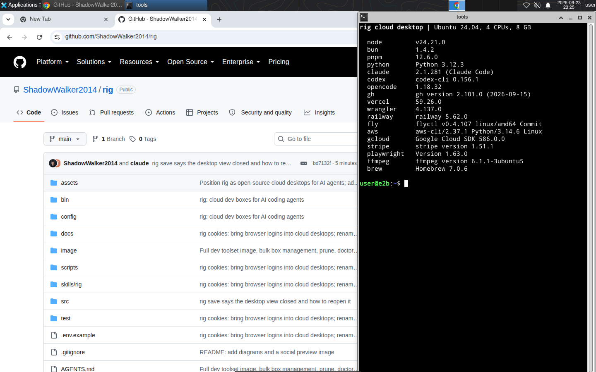
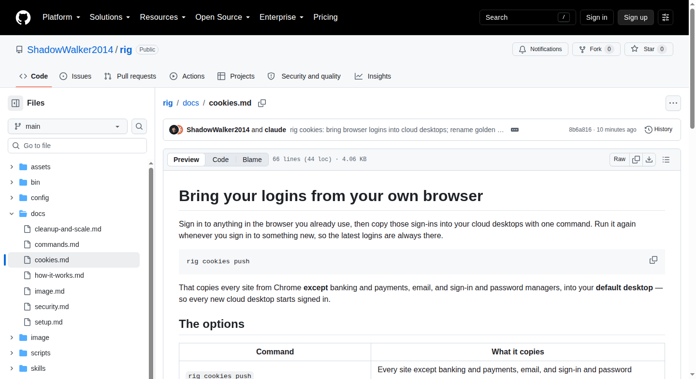

# rig — open-source cloud desktops for AI agents

**Give every AI agent its own cloud desktop. Your laptop stays fast, so you can run many agents at once.**

Each cloud desktop is a Linux machine with your code, a running dev server, tests and a signed-in Chrome. It sleeps when nobody uses it and wakes in a second. Claude Code, Cursor or Codex keeps editing code on your laptop and does the heavy work in its cloud desktop.

[](LICENSE)

<p align="center"></p>

## Contents

- [Why rig](#why-rig)
- [What you get](#what-you-get)
- [See it working](#see-it-working)
- [How it works](#how-it-works)
- [Setup](#setup)
- [Bring your logins from your browser](#bring-your-logins-from-your-browser)
- [Use it in a repo](#use-it-in-a-repo)
- [Take over the desktop](#take-over-the-desktop)
- [Saved desktops](#saved-desktops)
- [Use it with your coding agent](#use-it-with-your-coding-agent)
- [Manage and clean up](#manage-and-clean-up)
- [What's inside a cloud desktop](#whats-inside-a-cloud-desktop)
- [Settings](#settings)
- [Security](#security)
- [FAQ](#faq)
- [Docs](#docs)

## Why rig

One coding agent barely uses your laptop. What freezes it is everything around the agent: a dev server per branch, a Chrome for checking the UI, and test runs. Two or three tasks in, a 16–24 GB laptop starts swapping.

rig moves that work into a cloud desktop per branch. Your laptop runs only the agents.

<p align="center"></p>

## What you get

| | |
|---|---|
| **Sleeps when idle** | A cloud desktop pauses after 15 quiet minutes with everything still running inside, costs nothing while paused, and wakes in about a second. |
| **Starts signed in** | Copy your logins from Chrome, Arc, Edge, Brave, Firefox or Safari with one command. Every new cloud desktop starts with them. |
| **You can take over** | Open the desktop's screen in any browser tab to finish a login or a 2FA code. It is the same Chrome the agent drives. |
| **No push needed** | Your local edits — committed or not — reach the cloud desktop with `rig sync`. |
| **Your whole toolbelt** | Node, Bun, Python, Playwright, Puppeteer, the Vercel, Cloudflare, Railway, Fly, AWS, Google Cloud, GitHub and Stripe CLIs, Claude Code, Codex and more. |
| **Private by default** | Ports are never public, your API key never touches the repo you work in, and cookie values are never printed. |
| **Built for many** | Filters and bulk actions work across thousands of cloud desktops, and one command cleans up the stale ones. |

## See it working

These are real screenshots from a cloud desktop, taken with rig.

<p align="center"></p>
<p align="center"><sub><b>The cloud desktop's screen</b>, as you see it in any browser tab with <code>rig desktop</code>: Chrome, and the tools every cloud desktop comes with.</sub></p>

<p align="center"></p>
<p align="center"><sub><b>What your agent sees</b> with <code>rig shot</code>: a screenshot of the cloud desktop's Chrome, saved to your laptop. This one is a fresh desktop, not yet signed in.</sub></p>

## How it works

<p align="center"></p>

1. **`rig up`** gives this branch a cloud desktop: your code is copied in, packages are installed and the dev server starts.
2. **`rig sync`** sends your local edits to it.
3. **`rig exec`** runs tests there; **`rig browser`** drives its signed-in Chrome.
4. **`rig desktop`** lets you see and control its screen.
5. **`rig save`** makes a signed-in cloud desktop your default desktop, so every new one starts as a copy of it.

In the CLI, a cloud desktop is called a **box**.

## Setup

About 20 minutes, most of it waiting for the image to build. The full walkthrough is in the [setup guide](docs/setup.md).

You need [Bun](https://bun.sh) 1.2+ and an [E2B](https://e2b.dev) account.

**1. Install rig**

```bash
bun add -g github:ShadowWalker2014/rig     # npm release coming: npm install -g @shadowwalker2014/rig
```

**2. Add your E2B key**

```bash
rig login     # macOS: the Keychain asks for the key, so it never shows on screen
```

Not on a Mac? Copy [.env.example](.env.example) to `~/.config/rig/.env`, run `chmod 600` on it, and set `RIG_E2B_API_KEY`.

**3. Build the image** (once, about 10 minutes)

```bash
rig image build
```

**4. Sign in to your tools**

```bash
rig cookies push             # your browser's logins, except banking and payments
```

For command-line tools, sign in inside a cloud desktop, then save it:

```bash
rig new                      # an empty cloud desktop; prints its id
rig desktop <id>             # open the link; sign in to 1Password, Google, `gh auth login`, `vercel login`…
rig save <id>                # every new cloud desktop now starts signed in
rig saved                    # your saved desktops; * is the one new boxes start from
```

**5. Teach your coding agent**

```bash
rig skill install            # Claude Code
```

**6. Check everything**

```bash
rig doctor                   # every line should start with ✓
```

## Bring your logins from your browser

Sign in to anything in the browser you already use, then copy those logins into your cloud desktops. Run it again whenever you sign in to something new.

| Command | What it copies |
|---|---|
| `rig cookies push` | Every site **except** banking and payments — Google, GitHub, email and everything else go |
| `rig cookies push --all` | Every site, banking and payments too. You confirm at the terminal first. |
| `rig cookies push --site github.com,linear.app` | Only those sites |
| `rig cookies push --skip notion.so` | The default set, minus the sites you list |

| Add | To |
|---|---|
| `--from arc` or `--from chrome:Work` | Use another browser or profile |
| `-b <box>` | Update one cloud desktop instead of your default desktop |

See what is there first — neither command reads a cookie value or asks for access:

```bash
rig cookies browsers             # Chrome, Edge, Brave, Arc, Comet, Chromium, Vivaldi, Opera, Firefox, Safari
rig cookies sites --from chrome  # each site's cookie count, and which ones stay out by default
```

**How it stays safe:** rig prints only site names and counts, never a value. Cookies are decrypted in memory and sent over E2B's encrypted connection straight into the cloud desktop's Chrome. For Chrome-family browsers, macOS asks you to approve access each time — click **Allow**, not Always Allow. `--all` refuses to run from an agent or script. Banking and payment sessions stay on your laptop unless you ask for them.

Some sites refuse a login copied from another computer — Google accounts do. For those, sign in once inside the cloud desktop with `rig desktop`, then `rig save`.

Details: [docs/cookies.md](docs/cookies.md).

## Use it in a repo

```bash
cd my-repo
rig up          # the first time, it works out how the repo runs and asks about env files
```

The first `rig up` in a repo runs `rig init`: it detects the package manager, the dev command and its port, and asks before copying gitignored env files like `.env.local` into the box. The answers go in a small `rig.json`. If the box can't read a private repo, `rig up` stops before anything slow and prints the exact fix. Details: [using rig in a repo](docs/projects.md).

### Every task

<p align="center"></p>

```bash
cd my-repo
rig up                                       # this branch's cloud desktop, with the dev server running
rig sync                                     # after editing locally
rig exec -- bun test                         # any command, in its copy of the repo
rig exec -- 'bunx tsc --noEmit && bun run lint'
rig browser -- open http://localhost:3000    # drive its signed-in Chrome
rig browser -- snapshot -i                   # the page's buttons and fields, for an agent
rig shot                                     # screenshot to a local file
rig port 3000                                # open its app at http://localhost:3000 on your laptop
rig logs                                     # the dev server's output
```

Parallel agents on one branch? `rig up --new` gives each its own cloud desktop; pass `-b <id>` to the other commands.

A repo's `rig.json`, written by `rig init`:

```json
{ "setup": "bun install", "dev": "bun run dev", "port": 3000, "copy": [".env.local"], "submodules": true }
```

`rig status` shows the settings in use.

## Take over the desktop

```bash
rig desktop <box>       # or just `rig desktop` inside a repo
```

rig prints a private link. Open it in any browser tab to see and control the cloud desktop's screen: finish a login, type a 2FA code, or watch the agent work. The link works only on your machine and only while the command runs; Ctrl-C closes it.

## Saved desktops

Set up a cloud desktop once — sign in, install what you need — and save it. Every new cloud desktop starts as a copy of your **default** saved desktop: its files, its logins and its already-running Chrome.

| Command | Does |
|---|---|
| `rig save <box>` | Save this box as your default desktop (or update it) |
| `rig save <box> --as work` | Save it under another name; add `--use` to make it the default |
| `rig saved` | List saved desktops; `*` marks the default |
| `rig saved use work` | New boxes now start from `work` |
| `rig new --from work` | Start one box from `work` without changing the default |
| `rig saved rm work` | Delete a saved desktop |
| `rig status` | The default, running and paused boxes, and this branch's box |

rig reminds you to save: closing `rig desktop` on a clean box prints the `rig save` command, and `rig doctor` flags a missing default.

Save a clean cloud desktop made with `rig new`. rig refuses to save one that ran a repo's code, because that code could have planted something that would spread to every cloud desktop started from it.

## Use it with your coding agent

rig ships with an agent skill: instructions that tell your coding agent to run dev servers, tests and browser checks in its cloud desktop instead of on your laptop, and how to hand the screen to you for a login.

```bash
rig skill install                        # Claude Code
npx skills add ShadowWalker2014/rig      # Claude Code, Cursor, Codex, opencode and more
rig guide                                # the same instructions, for any other agent's AGENTS.md
```

Every command also explains itself: `rig help <command>`.

## Manage and clean up

```bash
rig ls                                   # every cloud desktop: state, repo, branch, last used
rig ls --state running                   # what is costing money right now
rig pause --all                          # stop the meter on everything
rig prune                                # preview: paused cloud desktops unused for 7 days
rig prune --merged --yes                 # delete those, plus ones whose branch is gone
rig kill --repo acme/web --state paused --yes
rig doctor                               # key, image, default desktop and settings
```

Filters (`--state`, `--older-than 7d`, `--repo`, `--branch`, `--here`, `--all`) run on E2B's side, so they stay fast with thousands of cloud desktops. A filtered delete previews first and only deletes with `--yes`.

**Cost:** rig is free. You pay E2B for running time — about $0.33 an hour for 4 CPUs / 8 GB at [E2B's rates](https://e2b.dev/pricing). Paused cloud desktops cost nothing. More in [cleanup and scale](docs/cleanup-and-scale.md).

## What's inside a cloud desktop

Ubuntu 24.04 with an Xfce desktop and Google Chrome, plus:

| Area | Tools |
|---|---|
| JavaScript | Node 24, npm, bun, pnpm |
| Deploy and cloud | vercel, wrangler, railway, fly, aws, gcloud, gh, stripe, e2b |
| AI coding agents | claude, codex, opencode |
| Browsers and testing | Chrome with the 1Password extension, Playwright with Chromium, Puppeteer, agent-browser |
| Passwords | 1Password CLI (`op`) and Chrome extension — sign in once, then `rig save` |
| Python and media | python, pip, uv, whisper, ffmpeg, ImageMagick |
| Databases and everyday | psql, redis-cli, sqlite3, git, git-lfs, jq, ripgrep, tmux, Homebrew |

Add your own tools with a script at `~/.config/rig/image.sh`. See [the box image](docs/image.md).

## Settings

Set these in your shell or in `~/.config/rig/.env` (see [.env.example](.env.example)):

| Setting | Default | Meaning |
|---|---|---|
| `RIG_E2B_API_KEY` | Keychain, after `rig login` | Your E2B API key |
| `RIG_E2B_DOMAIN` | `e2b.app` | Only for self-hosted E2B |
| `RIG_IDLE_MIN` | `15` | Minutes without a rig command before a cloud desktop pauses |
| `RIG_BOX_CPU` / `RIG_BOX_MEMORY_MB` | `4` / `8192` | Size, set when the image is built |
| `RIG_DEFAULT_DESKTOP` / `RIG_BASE_TEMPLATE` | `rig-default` / `rig-base` | Names of your default desktop and image in E2B |

## Security

- **Your E2B key never touches the repo you work in.** rig reads it from your shell, a private settings file or the Keychain, and starts with its own empty settings, so a repo's `.env` or `bunfig.toml` never loads.
- **A hostile repo cannot reach your laptop through rig.** Its git settings cannot run programs, and no path, symlink or `rig.json` entry can upload a file from outside the repo.
- **Ports are private.** `rig port` and `rig desktop` serve them on your laptop's `127.0.0.1` only and refuse requests started by other websites. The desktop also has a one-time password.
- **Cookie values are never printed,** and banking and payment sessions stay out unless you ask.
- **Your default desktop is shared by every new cloud desktop.** Keep money-moving and production-write accounts out of it.

Full details: [docs/security.md](docs/security.md). Found a vulnerability? Please open a private [security advisory](https://github.com/ShadowWalker2014/rig/security/advisories/new).

## FAQ

### What is rig?
rig is open-source cloud desktops for AI agents. Each git branch gets a Linux desktop in the cloud with a dev server, tests and a signed-in Chrome, so AI agents can work in parallel without overloading your laptop. The agent still runs locally; rig moves only the heavy processes.

### Does rig work with Claude Code, Cursor, Codex and other agents?
Yes. Any agent that can run shell commands can use rig. `rig skill install` adds a Claude Code skill, `npx skills add ShadowWalker2014/rig` installs it for other agents, and `rig guide` prints the instructions for anything else.

### How do I get my existing logins into a cloud desktop?
Run `rig cookies push`. It copies your browser's logins — except banking and payment sites — into your default desktop, so every new cloud desktop starts signed in. Use `--site` to pick sites or `--all` to include everything.

### How is rig different from Claude Code on the web, GitHub Codespaces or Daytona?
Claude Code on the web runs the whole agent in the cloud and starts every session without your logins. Codespaces loses running processes when it stops. rig keeps the agent on your laptop, keeps each cloud desktop's memory while paused, starts every one already signed in, and lets you take over the browser.

### How much does it cost?
rig is free and MIT licensed. You pay E2B for running time: about $0.33 an hour for a 4 CPU / 8 GB cloud desktop at E2B's [published rates](https://e2b.dev/pricing). Paused ones cost nothing.

### Does the dev server think it is running on localhost?
Yes. It sees `Host: localhost:<port>`, so dev-origin checks and OAuth redirect callbacks behave as on a laptop. Providers that POST back from their own site (like Sign in with Apple's `form_post`) are blocked by rig's cross-site protection; finish those through `rig desktop`.

### Does rig work on Linux or Windows?
The CLI runs anywhere Bun runs; use `~/.config/rig/.env` for your key on Linux. Copying browser logins works on macOS. Windows is untested.

### Why E2B?
E2B combines what rig needs: pausing with memory kept, waking on traffic, snapshots of a running machine that start many new ones, private ports, and machines big enough for a real dev server.

## Docs

| Read | For |
|---|---|
| [Setup guide](docs/setup.md) | First-time setup, step by step |
| [Using rig in a repo](docs/projects.md) | `rig up`, `rig init`, `rig.json`, env files, private repos |
| [Bring your logins](docs/cookies.md) | Copying sign-ins from your browser, and how it stays safe |
| [Command reference](docs/commands.md) | Every command, flag and example |
| [How it works](docs/how-it-works.md) | Lifecycle, syncing, the default desktop, the proxy, the code map |
| [Cleanup and scale](docs/cleanup-and-scale.md) | Costs, auto-pause, `prune`, bulk actions |
| [The box image](docs/image.md) | Installed tools, adding your own, size |
| [Security](docs/security.md) | How your key, logins and laptop are protected |
| [Contributing](AGENTS.md) | Code map, tests and safety rules |

## License

[MIT](LICENSE)
